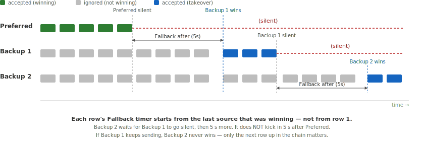

# Source Priority

When multiple data sources provide the same Signal K path (e.g. two GPS devices both providing `navigation.position`), Signal K Server needs to decide which source to use. The Source Priority system lets you control this on a per-path basis.

These features are available in the Admin UI under _Data -> Source Priority_.

## Understanding Multi-Source Paths

A **multi-source path** is any Signal K path that receives data from two or more sources. This is common on boats with:

- Multiple GPS receivers (e.g. a chartplotter GPS and a standalone GPS antenna)
- NMEA 0183 and NMEA 2000 devices providing the same data (e.g. depth from both buses)
- Plugins that derive or calculate values also provided by hardware (e.g. true wind)

Multi-source paths are not errors — they are a normal part of a multi-device installation. The Source Priority system helps you choose which source should be preferred for each path.

### Sidebar Badge

The sidebar shows a yellow warning badge on the _Data_ menu item when there are multi-source paths that have no priority configuration. The number indicates how many such paths exist. As you configure priorities, this count decreases. The badge updates in real time as sources come and go.

## How It Works

For each path, you list the sources that may provide it, in order of preference. The top row is the **preferred** source — while it is publishing data, its values always win. Every other row has a **Fallback after** value: the number of milliseconds the higher-priority source must be silent before this row is allowed to take over.



- Green bars: the preferred source is publishing data — its values are delivered.
- Grey bars: the backup source is publishing too, but its data is dropped because the preferred source is still active.
- Dashed red section: the preferred source has gone silent.
- Blue bars: once that silence has lasted as long as the backup's _Fallback after_, the backup starts winning and its values are delivered.
- When the preferred source returns, it immediately takes over again — no "Fallback after" wait applies to the preferred source.

### A Worked Example

Two GPS receivers on the boat both publish `navigation.position`. In the Admin UI they appear with human-readable labels; the underlying `$source` values are CAN Names:

| Row | Shown as                         | `$source` (CAN Name)    | Fallback after |
| --- | -------------------------------- | ----------------------- | -------------- |
| 1   | Furuno (`can0.c0788c00e7e04312`) | `can0.c0788c00e7e04312` | _preferred_    |
| 2   | Garmin (`can0.c0328400e7e00a86`) | `can0.c0328400e7e00a86` | `5000` (5 s)   |
| 3   | serial0.GP                       | `serial0.GP`            | `30000` (30 s) |

- While Furuno is publishing, only Furuno values reach subscribers.
- If Furuno goes quiet for 5 seconds, Garmin values start being accepted.
- If Garmin is also silent for 30 seconds _from when Furuno went silent_, the NMEA 0183 GPS takes over as a last resort.
- The moment Furuno sends again, it wins again.

### Disabling a Source on a Path

Uncheck **Enabled** on a row (internally, _Fallback after_ = `-1`) to block that source on this path entirely, no matter how silent the others become.

### Sources Not Listed

Data from a source that is not listed in the priority table for a path is allowed to take over only after **every listed source has been silent for a default of 10 seconds**. This is a safety fallback so an unconfigured new device on the bus doesn't suddenly hijack a path you have not thought about.

### What is Not Filtered

`notifications.*` paths bypass source priority entirely — every source's notifications are delivered unchanged. Notifications are events, not measurements, so suppressing one source's alarm because another source is "preferred" is never the right behaviour.

All source data is preserved in the server's data model regardless of priority configuration. Priority only affects which source's values are delivered to subscribers by default. See [Source Priority in the Data Browser](#source-priority-in-the-data-browser) for how to view every source's data.

## Source Priority in the Data Browser

The Data Browser (_Data -> Browser_) has a **Sources** dropdown that controls which source's data is displayed:

- **Priority filtered** (default): shows only the preferred source's data for each path, respecting your priority configuration.
- **All sources**: shows data from every source. The preferred source for each path is marked with a green checkmark (**&#10003;**) so you can see which one would win under filtering.

Use **All sources** to:

- Verify that priority configuration is working correctly
- Compare values from different sources
- Debug sensor issues by seeing all incoming data

The **View** dropdown lets you switch between a flat path listing (**Paths**) and a source-grouped view (**By Source**) that shows the same full table grouped under source headers.

## Source Identification

Signal K Server identifies sources differently depending on the connection type:

### NMEA 2000 Sources

N2K sources are identified by their **CAN Name** — a globally unique 64-bit identifier derived from the ISO Address Claim (PGN 60928). Each device on the bus has a unique NAME even if the manufacturer and model are identical (the NAME includes a per-device unique number). This is more reliable than the source address (which can change when devices are added or removed from the bus).

The `$source` field contains the hex-encoded CAN Name, e.g. `can0.c0788c00e7e04312`, not the source address. If the Address Claim has not been received yet, the server falls back to the address, e.g. `can0.22`.

The Admin UI shows a human-readable label derived from the manufacturer and model (PGN 60928 + 126996), e.g. _Furuno (can0.c0788c00e7e04312)_. You can set a custom alias via the pencil icon next to any source label. Two identical devices (same manufacturer and model) have different CAN Names, so aliases help distinguish them — e.g. "Bow GPS" and "Stern GPS".

See [NMEA 2000 Device Management](./n2k-device-management.md) for details.

### NMEA 0183 Sources

NMEA 0183 sources are identified by the connection name and talker ID, e.g. `serial0.GP`.

### Plugin Sources

Plugin sources use the plugin ID as their `$source`, e.g. `derived-data` or `signalk-venus-plugin`.

## REST API

> The server implementation is authoritative.
> Request/response payloads below are illustrative examples and may evolve.

The Source Priority configuration is managed through the following REST endpoints:

### GET /skServer/sourcePriorities

Returns the current path-level priority configuration.

**Response:**

```json
{
  "navigation.position": [
    { "sourceRef": "can0.c0788c00e7e04312", "timeout": 0 },
    { "sourceRef": "can0.c0328400e7e00a86", "timeout": 5000 }
  ]
}
```

The JSON field name is still `timeout` for backwards-compatibility; semantically it is the _Fallback after_ value — milliseconds of silence from higher-priority sources required before this entry is allowed to take over. The first entry's value is ignored (it is the preferred source). A value of `-1` disables the source on that path.

### PUT /skServer/sourcePriorities

Saves a new path-level priority configuration. Requires admin access.

**Request body:** Same format as the GET response.
